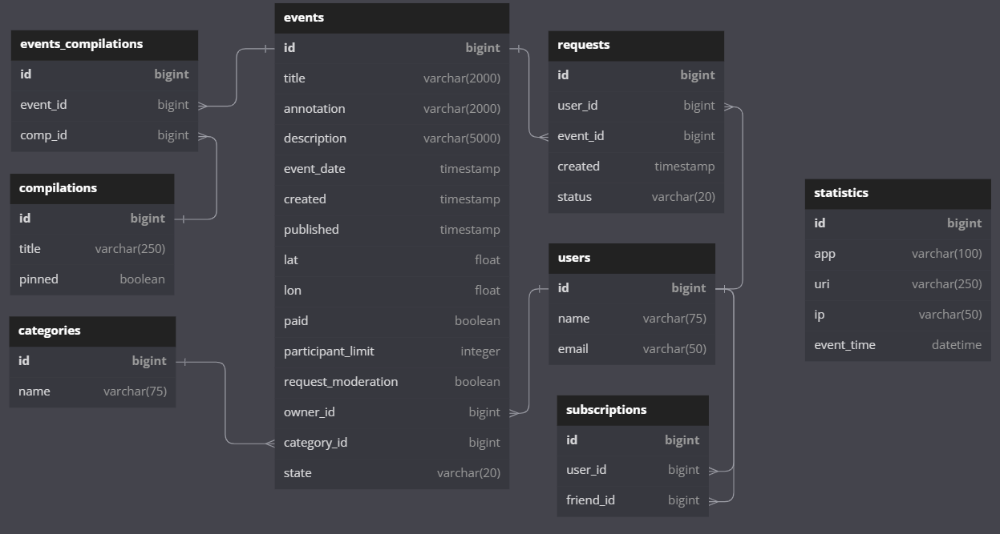

## Explore With Me
Приложение-афиша, где можно предложить какое-либо событие от выставки до похода в кино и набрать компанию для участия в нём.

## Описание
Приложение построено на основе двух сервисов:
1. Основная часть отвечает за CRUD-операции для категорий, мероприятий, пользователей, а также за взаимодейтвие с БД.
2. Сервис статистики хранит количество просмотров и позволяет делать различные выборки для анализа работы приложения.

 Приложение упаковано в 4 Docker-контейнера.

## Функционал

1. **Основной сервис** включает в себя функции для использования администраторами, авторизованными 
пользователями и незарегистрированными пользователями("случайными прохожими").

  *__Администраторы могут__*:
 - управлять категориями для событий - добавлять, измененять и удалять категории.
 - управлять подборками мероприятий - добавлять, удалять и закреплять на главной странице.
 - модерировать события, размещённые пользователями, — публикация или отклонение.
 - управлять пользователями — добавлять, просматривать и удалять.
 - получать подробную информацию об всех лайках/дизлайках указанного события.
  **_Авторизованные пользователи могут_**:
 - добавлять в приложение новые мероприятия, редактировать их и просматривать после добавления.
 - подавать заявки на участие в интересующих мероприятиях.
 - подтверждать заявки, которые отправили другие пользователи сервиса (доступно только для 
организаторов событий).
 - подписываться на друзей и видеть список событий, в которых они участвуют.
 - получать краткую информацию обо всех лайках/дизлайках своего события.
  **_Незарегистрированные пользователи("случайные прохожие") могут_**:
 - просматривать список событий с краткой информацией по ним, в соответствии с выбранной 
сортировкой(по количеству просмотров событий, по дате событий или по рейтингу событий).
 - просматривать подробную информацию о выбранном событии.
 - просматривать все имеющиеся категории событий.
 - просматривать подборки событий, составленные администратором.

2. Второй сервис, **статистики**, призван собирать информацию. 
  _Во-первых_, о количестве обращений 
пользователей к спискам событий.
  _Во-вторых_, о количестве запросов к подробной информации 
о событии. 
  На основе этой информации формируется статистика о работе приложения.

## Спецификация

Спецификацию для сервисов можно посмотреть на сайте [Swagger](https://editor-next.swagger.io/), 
импортировав туда [файл](https://github.com/welderdefender/explore-with-me/blob/main/postman-and-api-specs/ewm-main-service-api.json) для основного сервиса 
и [файл](https://github.com/welderdefender/explore-with-me/blob/main/postman-and-api-specs/ewm-stats-service-api.json) для сервиса статистики.

## Шаблон проектирования

  В приложении использован шаблон проектирования Data Transfer Object (DTO Pattern).

## Работа с БД

## Запуск приложения
1. Склонировать репозиторий и открыть его в IntelliJ IDEA.
2. Ввести в терминале команду docker-compose up

## Тестирование в Postman
Для запуска коллекции тестов необходимо предварительно запустить приложение командой docker-compose up, затем импортировать [тесты для основного сервиса](https://github.com/welderdefender/explore-with-me/blob/main/postman-and-api-specs/ewm-main-service.json) и [тесты для сервиса статистики](https://github.com/welderdefender/explore-with-me/blob/main/postman-and-api-specs/ewm-stat-service.json) в Postman и запустить их.

## Автор
Со мной можно связаться в [Telegram](https://t.me/welderdefender).
 welderdefender@yandex.ru
